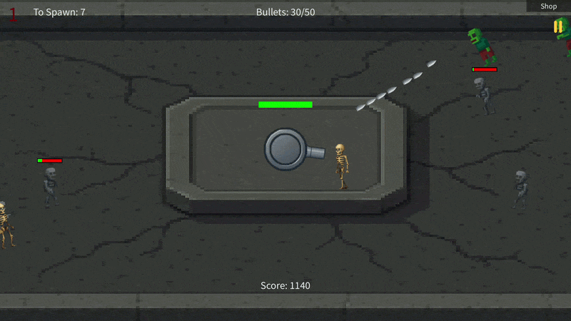

# Zombie Shooter

A 2D zombie defense game built using Java and Processing.

The player must defend their gun from waves of enemies approaching from different directions. As the rounds progress, enemies become more challenging, while players can purchase upgrades to improve their chances of survival.

## Gameplay

## Features

* Wave-based zombie survival gameplay
* Multiple enemy types with different behaviours
* Dynamic enemy spawning from different directions
* Progressive difficulty across rounds
* Shooting and bullet mechanics
* Collision detection
* Player health and damage system
* Upgrade shop for improving the player's equipment
* Enemy drops and rewards
* Persistent high-score saving
* Animated game elements and UI

## Enemy Types

The game includes multiple enemy classes, each providing different challenges:

* **Zombie** — Standard enemy type
* **Walker** — Alternative enemy with different movement behaviour
* **Skeleton** — Enemy with its own movement and combat behaviour
* **Dog** — Fast-moving enemy that adds pressure to the player

## Upgrade System

Players can earn resources during gameplay and use them in the shop to purchase upgrades.

Upgrades allow the player to improve their equipment and survive increasingly difficult rounds.

## Rounds & Difficulty

The game uses a round-based progression system. Each round introduces increasingly difficult enemy encounters, requiring the player to manage their shooting, movement and upgrades effectively.

## Object-Oriented Design

The project uses object-oriented programming to separate game functionality into dedicated classes.

Examples include:

* `Enemy` — Base enemy functionality
* `Zombie` — Zombie enemy implementation
* `Walker` — Walker enemy implementation
* `Skeleton` — Skeleton enemy implementation
* `Dog` — Dog enemy implementation
* `Gun` — Player weapon and shooting mechanics
* `Bullets` — Projectile behaviour
* `Drops` — Enemy drops and rewards
* `Round` — Round and difficulty management
* `Shop` — Upgrade system
* `Database` — Persistent data management

## Controls

* **Mouse** — Aim and shoot

## Technologies

* **Java**
* **Processing**

## Running the Game

1. Install [Processing](https://processing.org/)
2. Clone this repository
3. Open `ZombieSiege.pde` in Processing
4. Ensure the `images` and `data` files are present
5. Run the sketch

## Project

This project was developed to explore object-oriented programming, 2D game development, enemy AI/behaviour, collision detection, game progression, upgrade systems and persistent data storage.
